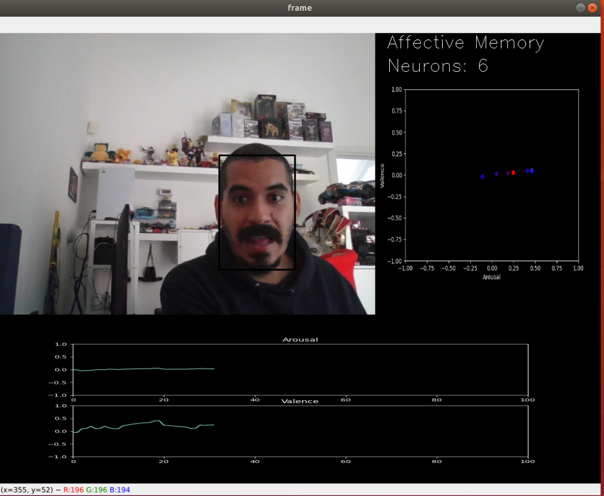

.. FaceChannel documentation master file, created by
   sphinx-quickstart on Thu Oct 21 11:05:44 2021.
   You can adapt this file completely to your liking, but it should at least
   contain the root `toctree` directive.

Welcome to FaceChannel's documentation!
=======================================

This project aims at providing a ready-to-use solution for facial expression recognition.
The models available here are free to be used for personal and academic purpose.

.. toctree::
   :maxdepth: 1
   :caption: Contents:

   quickstart
   FaceChannelV1
   SelfAffectiveMemory
   license
   contact

Acknowledgment
==============
This environment and all its development is supported by a Starting Grant from the European Research Council (ERC) under the European Union's Horizon 2020 research and innovation programme. G.A. No 804388, wHiSPER.